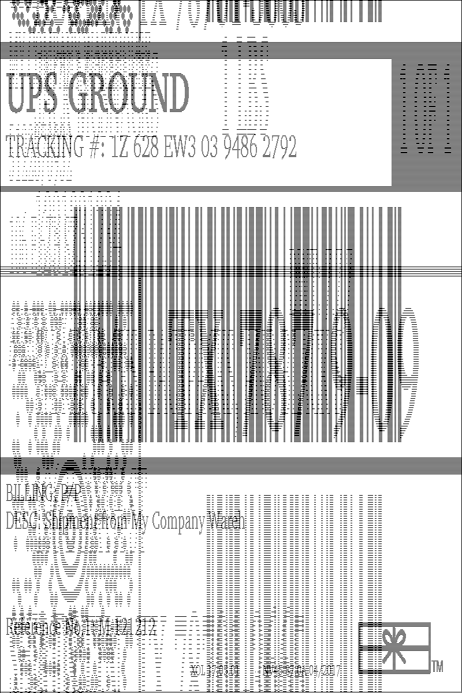
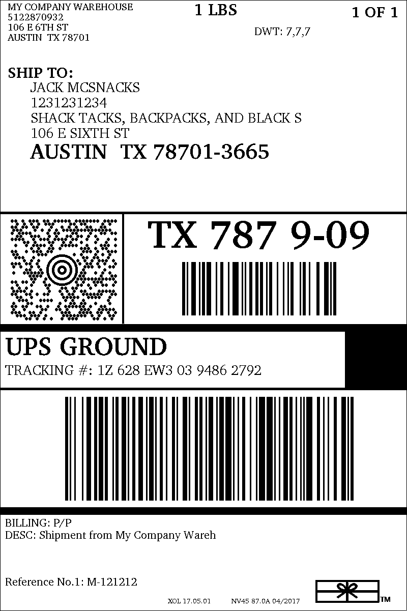

## Problem
There is a problem with some GIF images that causes them to be output incorrectly when processed through https://github.com/Automattic/node-canvas

### output/messed_up.gif


### assets/looks_fine.gif


## Steps to Reproduce
```bash
yarn start
```
or
```bash
./run.sh
```
